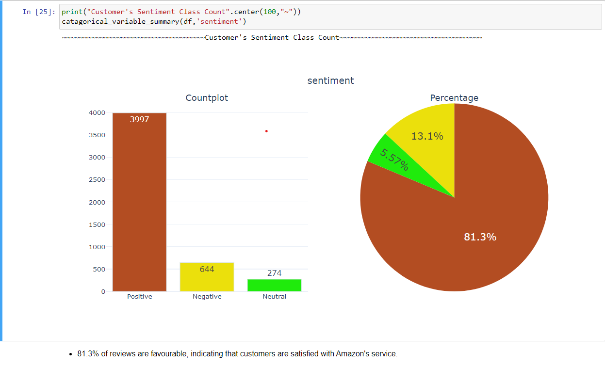

# Customer-Sentiment-Analysis

Make use of SentimentIntensityAnalyzer which calculates the polarity of customer's reviews for amazon products.

Analyzed Amazon customer reviews using Python, leveraging NLTK for preprocessing techniques like tokenization and lemmatization, along with pandas for efficient data manipulation, and regular expressions for data cleaning.

<ul>
  <li>Implemented sentiment analysis using SentimentIntensityAnalyzer to categorize reviews as "Positive", "Negative", or "Neutral".</li>
  <li>Visualized results using Plotly, showcasing a count plot illustrating review counts and a pie chart representing the distribution of sentiments showing 81.3% favorable reviews, indicating high customer satisfaction.</li>
</ul>

